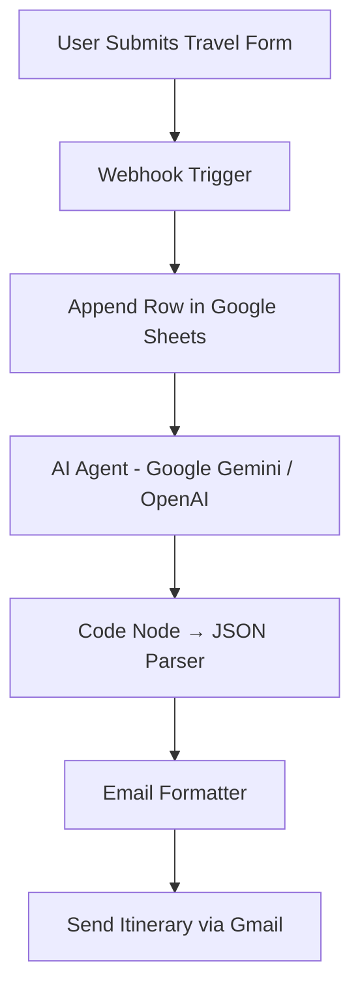
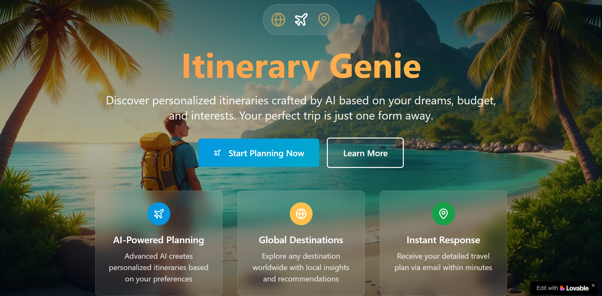
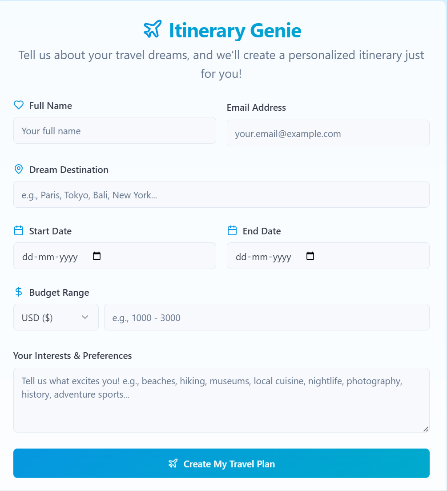
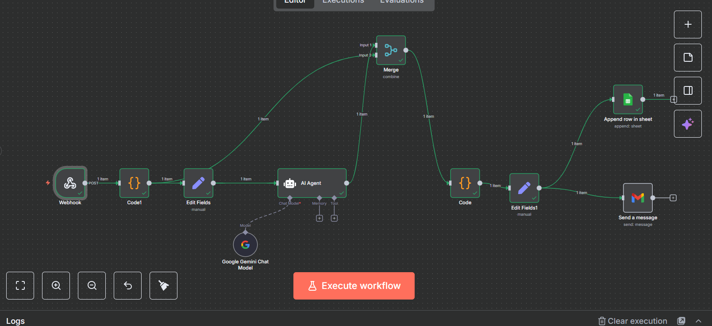
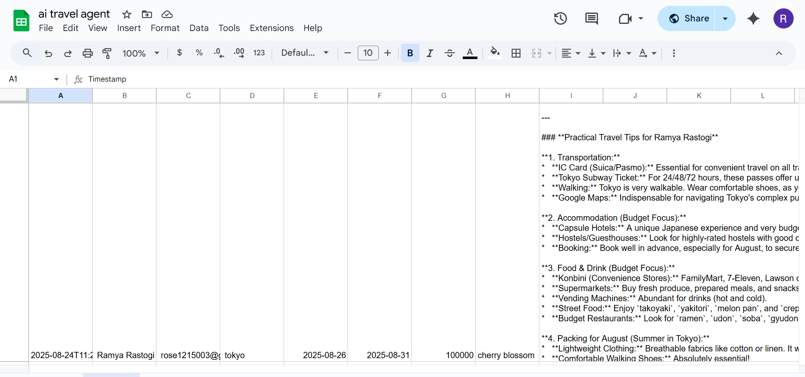
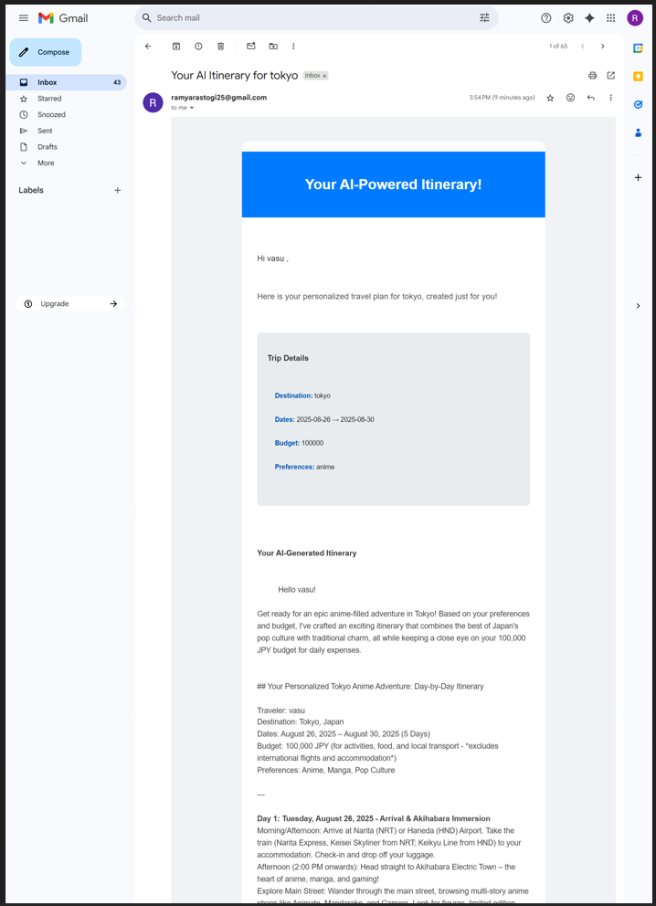

# ✈️ Itinerary Genie – Your AI-Powered Travel Itinerary Planner 

> **Plan smarter. Travel better. Live the journey.**

---

## 🚀 Overview

**Itinerary Genie** is an AI-driven travel itinerary generator that crafts **personalized travel plans** based on your **destination, budget, and preferences**.  
It uses **Google Gemini AI** and **n8n automation** to analyze your data, generate a structured travel itinerary, and send it directly to your **email inbox** — all in minutes.

🌐 **Live Demo:** [Itinerary-Genie.lovable.app](https://ai-trip-orchestrator.lovable.app)

---

## 🧠 How It Works (Workflow Animation)

> **Workflow Flow:**  
> `Webhook → Google Sheets → AI Agent → Code Parser → Email Formatter → Gmail Sender`

  
  ✨ The system transforms your travel preferences into a complete itinerary JSON, converts it into human-readable format, and emails it to you automatically.
  
---

## 🎬 Visual Demo

<table>
  <tr>
    <td align="center">
       
      <b>Website Home</b>
    </td>
    <td align="center">
       
      <b>Website Operation</b>
    </td>
    <td align="center">
       
      <b>n8n Operation</b>
    </td>
    <td align="center">
       
      <b>n8n Operation Complete</b>
    </td>
    <td align="center">
       
      <b>Email Received</b>
    </td>
  </tr>
</table>

---

## 📸 Website Snapshots

Here are some snapshots showing the functionality and features of the project:
 
 

 
 
 

 
 
 

 
 
 

 
 
 

---

## 🧩 Tech Stack

| Category | Technology | Description |
|-----------|-------------|-------------|
| **Frontend** | [Lovable.app](https://lovable.app) | No-code/low-code frontend for intuitive travel form UI |
| **Backend Automation** | [n8n](https://n8n.io/) | Workflow automation for connecting AI, Sheets, and Email |
| **AI Engine** | Google Gemini / OpenAI GPT | Generates personalized travel itineraries in structured JSON |
| **Database** | Google Sheets API | Stores user input data and generated plans for tracking |
| **Email Service** | Gmail API | Sends the final itinerary directly to the user |
| **Scripting** | Node.js (inside n8n Code Node) | Custom JSON parsing and email formatting logic |
| **Hosting** | [Lovable Cloud](https://lovable.app) | Deploys the interactive web app frontend securely |

---

## ⚡ Performance Comparison

| Feature | **Voyage** | **Manual Trip Planning** | **Other AI Travel Tools** |
|----------|-------------|---------------------------|----------------------------|
| **Personalization Level** | ⭐ **High** — full itinerary, budget & interest-based | ❌ Limited — depends on user research | ⚡ Moderate — generic templates |
| **Automation** | ✅ End-to-End (AI → Email Delivery) | ❌ Manual process | ⚠️ Partial automation |
| **AI Quality** | 🤖 Gemini / GPT-based reasoning | ❌ None | ⚙️ Varies per tool |
| **Response Time** | ⚡ Under 30 seconds | 🕐 Hours to days | ⚡ 1–2 minutes |
| **Data Storage** | ✅ Google Sheets API | ❌ Manual notes | ⚠️ Cloud-based |
| **User Experience** | 🎨 Web UI + Auto Email | 🧾 Text or spreadsheets | ⚙️ Web dashboard |
| **Cost** | 💸 Free (uses APIs & automation) | 💰 High (manual effort) | 💰 Subscription or pay-per-plan |
| **Scalability** | ⚙️ Fully automated with n8n | ❌ None | ⚡ Limited to platform capacity |

---

### 💡 Why Voyage Wins

✅ Personalized, AI-curated itineraries  
✅ Real-time automation (no human bottleneck)  
✅ Instant delivery via email  
✅ Modular n8n workflow (easy to scale or upgrade)  
✅ Cost-effective and user-frie

---

## 🚀 Future Improvements

Voyage is already capable of generating personalized travel itineraries using AI, but several exciting enhancements are planned to make it even more powerful and user-centric.

| Area | Planned Upgrade | Description |
|-------|------------------|-------------|
| 🛰️ **Real-Time Data Integration** | **Flight & Hotel APIs (SerpAPI, Skyscanner, etc.)** | Automatically fetch live flight and accommodation options based on travel dates and budget. |
| 🌦️ **Weather-Aware Itineraries** | **Dynamic Scheduling** | Adjust the daily plan automatically depending on real-time weather forecasts for the destination. |
| 🗺️ **Interactive Map Visualization** | **Google Maps API Integration** | Display a route map showing attractions and optimized paths for each day of the itinerary. |
| 👥 **Group Itinerary Planning** | **Multi-User Collaboration** | Allow groups or families to plan trips together with shared editing and voting features. |
| 💬 **AI Travel Companion** | **Chat-Based Guidance** | Add a conversational assistant for live travel advice, translation help, and quick recommendations. |
| 🧭 **Specialized AI Sub-Agents** | **Budget Advisor, Culture Guide, and Food Finder** | Modular AI agents that focus on budgeting, cultural insights, and cuisine discovery. |
| 📱 **Mobile-Friendly PWA** | **Offline Access Support** | Build a Progressive Web App for on-the-go access, even without an internet connection. |
| 🔒 **User Profiles & History** | **Personalized Dashboards** | Save user itineraries, preferences, and destinations for future trip planning. |

> 🧠 *"Each new iteration of Voyage aims to transform your trip planning into a truly intelligent, real-time, and stress-free experience."*

---

